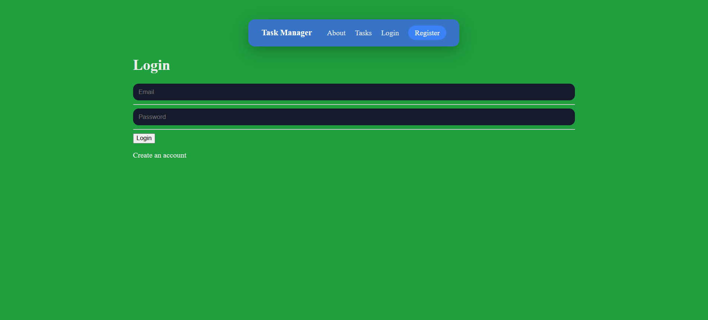

# Task Manager

A full-stack task management web application built with Flask that supports authenticated users, guest sessions, and persistent task ownership.

# Features
User authentication (register, login, logout)

Guest task creation with automatic ownership transfer on signup/login

Per-user task ownership and access control

Create, edit, complete, and delete tasks

Search, filter, and sort tasks

SQLite database with enforced constraints and migrations

Production deployment using WSGI

# Tech Stack
Backend: Python, Flask

Database: SQLite

Frontend: HTML, CSS, Jinja2 templates

Auth & Security: Werkzeug password hashing, session management

Deployment: WSGI, Render

Tooling: Git, GitHub Actions (sanity import checks)

## Screenshots

### Home


### Login


### Tasks


# Setup

```bash
git clone https://github.com/josephshinkle/task-manager.git
cd task-manager

python -m venv .venv
source .venv/bin/activate   # Mac/Linux
# .\.venv\Scripts\activate  # Windows

pip install -r requirements.txt
python -m Project.app
